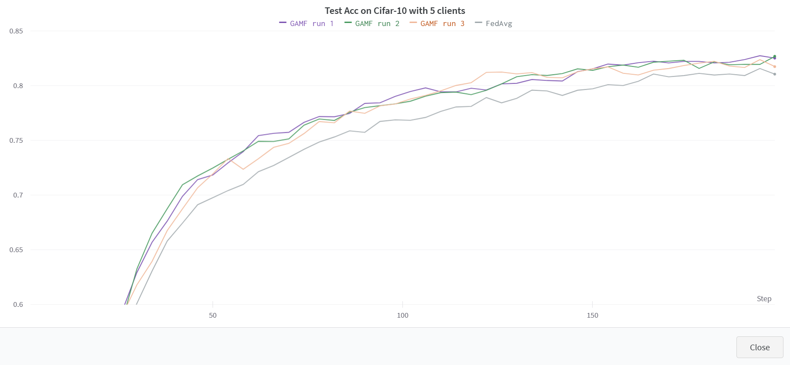
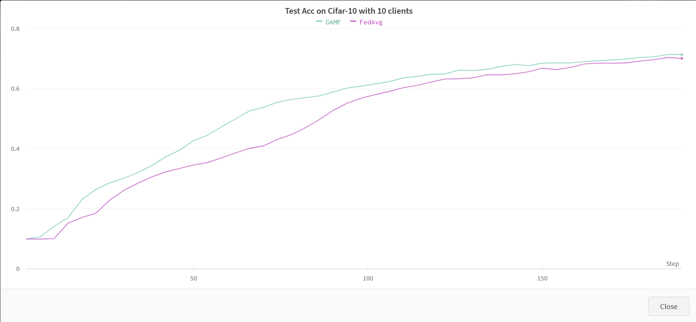

# GAMF
This repo provides code for 'Deep Neural Network Fusion via Graph Matching with Applications to Model Ensemble and Federated Learning', ICML 2022.

Run federated_learning_with_FedML.py to test the performance of our proposed GAMF. 

Our code is based on the code of [FedML](https://github.com/FedML-AI/FedML) and [OTFusion](https://github.com/sidak/otfusion), thanks for their open-source code.

For a simpler version, please refer to [here](https://pygmtools.readthedocs.io/en/latest/auto_examples/pytorch/plot_model_fusion_pytorch.html).

